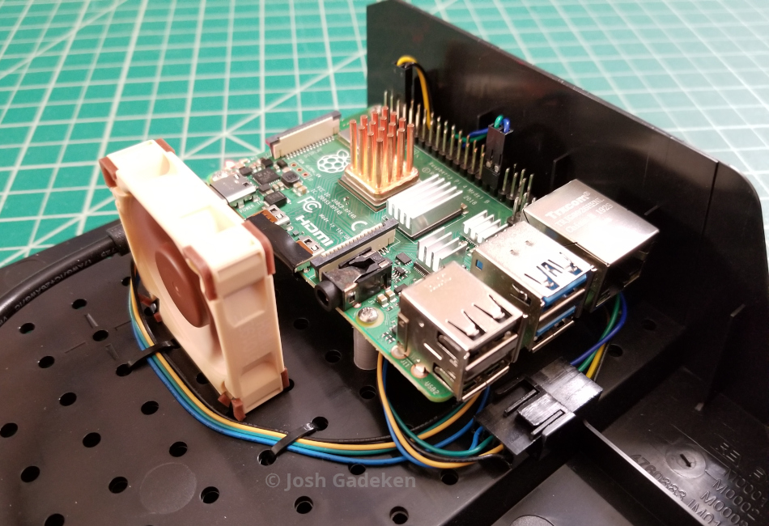

# RPi PWM Fan Controller #

`fanctl` is a Python daemon that proportionally controls a 4-pin PWM fan (e.g. the [Noctua NF-A4x10 5V](https://noctua.at/en/products/fan/nf-a4x10-5v-pwm)) based on the Raspberry Pi's CPU temperature. It also has a '0db' mode in which the fan does not spin if the CPU temperature is below the trigger point.




## Requirements ##

`fanctl` depends on the [pigpio](http://abyz.me.uk/rpi/pigpio/) daemon and Python 3 library. To install them on the RPi, run:

```
sudo apt install python3-pigpio pigpio
sudo systemctl enable pigpiod.service
sudo systemctl start pigpiod.service
```

Once pigpio is installed, clone this repo to your home directory on your RPi:

```
cd ~/
git clone https://github.com/process1183/rpi-fanctl.git
```


## Installation ##

First, add the following lines to `/boot/config.txt` below the `Additional overlays and parameters are documented /boot/overlays/README` line(s), then reboot:

```
# Set initial states for fan GPIO pins
# https://www.raspberrypi.com/documentation/computers/config_txt.html#gpio-control
gpio=6=ip,pu
gpio=13=op,dl
```


**Note**: By default, the Makefile installs the systemd unit file for the current user, as the `fanctl.py` daemon does not need root privileges. If you wish to change which user it is installed for, edit the `DAEMON_USER` variable in the Makefile.

To install the script, config file, and systemd unit file:

```
cd ~/rpi-fanctl
make install
```

The `fanctl` daemon will not yet be started in case you wish to change any settings (see configuration section). To start the daemon, run `sudo systemctl start fanctld@$(whoami).service`, or reboot the RPi.


## Configuration ##

Once installed, you can change several `fanctl` parameters such as trigger temp and PWM pin by editing `/opt/fanctl/fanctl.conf`. The various available options and their defaults are detailed in the .conf file.


## Uninstallation ##

To uninstall the daemon and related files:

```
cd ~/rpi-fanctl/
make uninstall
```
